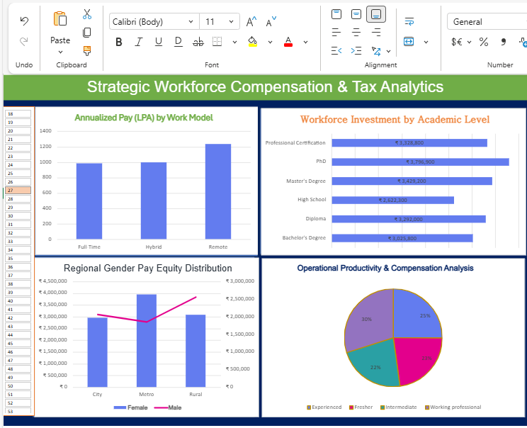

# **Strategic Workforce Compensation & Tax Analytics**

### **🖼 Dashboard Preview**

### **💻 Technical Note: Developed on Excel for the Web**
This entire dashboard was built exclusively using **Excel for the Web**. Despite browser-based interface constraints, I successfully implemented a high-performance reporting tool using:
* **Interactive Slicers:** A dynamic Age filter that updates all linked Pivot Charts simultaneously.
* **Advanced Data Modeling:** Analyzing a robust dataset of over **10,000 employee records**.
* **Professional UI/UX:** A custom-branded dashboard header with color-coordinated analytics.

### **📊 Dashboard Insights**
* **Workforce Investment:** Tracks total compensation against academic levels, showing significant investment in Professional Certifications and PhDs.
* **Regional Pay Equity:** Visualizes gender pay distribution across City, Metro, and Rural regions.
* **Operational Productivity:** A comparative analysis of productivity metrics mapped against total compensation.
